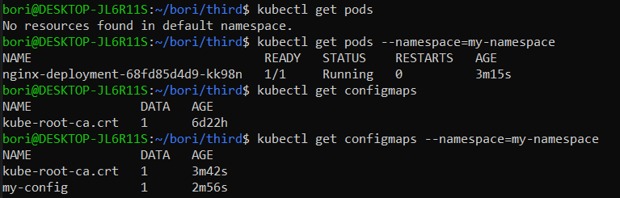
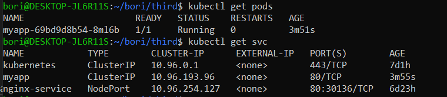

## Namespaces

Namespace: virtual cluster inside a cluster

4 namespaces by default

- kube-system: system processes
- kube-public: publicly accessible data, configmap with cluster information (`kubectl cluster-info`)
- kube-node-lease: heartbeats of nodes, determines the availability of a node
- default: resources are created here if user hasn't made any other namespaces

```bash
kubectl get namespaces
kubectl cluster-info
```

### Creating namespaces

Regex used for namespace names: `[a-z0-9]([-a-z0-9]*[a-z0-9])?`
For examples the name `my_namespace` is not good.

```bash
kubectl create namespace my-namespace
kubectl delete namespace my-namespace
```

Nodes and volumes can be accesed by every namespace.

Creating a resource on a namespace:

```bash
kubectl apply -f my-configmap.yaml --namespace=my-namespace
```

Example with yaml file:

```bash
kubectl create namespacw my-namespace
kubectl apply -f web-2048-deployment2.yaml
kubectl get pods
kubectl get pods --namespace=my-namespace
kubectl apply -f configmap.yaml
kubectl get configmaps
kubectl get configmaps --namespace=my-namespace
```


configmap.yaml:

```yaml
apiVersion: v1
kind: ConfigMap
metadata:
  name: my-config
  namespace: my-namespace
data:
    GREETING: "Hello from ConfigMap!"
```

## Bitnami Wordpress

```bash
helm repo add bitnami https://charts.bitnami.com/bitnami
helm repo list
helm repo update
kubectl create namespace wordpress
helm install my-wordpress bitnami/wordpress -n wordpress
```

### Accessing Bitnami Wordpress, and logging in as admin

First we need to port forward the wordpress service:

```bash
kubectl port-forward svc/my-wordpress 8080:80 -n wordpress
```

Then we need to get the username and password:

```bash
echo Username: user
echo Password: $(kubectl get secret --namespace wordpress my-wordpress -o jsonpath="{.data.wordpress-password}" | base64 -d)
```

Next go to http://localhost:8080/admin, and log in with username and password.

### Bitnami Wordpress source code

https://github.com/bitnami/charts

## Implementing my own App as a Helm Chart; installing it on my cluster with --set parameters

If using local image, then load the image with `kind load docker-image web-2048` first. With ` docker exec -it kind-control-plane crictl images` we can check the loaded images.

```bash
helm create myapp
helm install myapp ./myapp --set image.repository=web-2048,image.tag=latest,image.pullPolicy=Never
```



To uninstall a helm use:

```bash
helm uninstall myapp
```

sources:

https://www.youtube.com/watch?v=K3jNo4z5Jx8

https://www.youtube.com/watch?v=-ykwb1d0DXU

https://dev.to/akhil_mittal/deploy-custom-application-in-kubernetes-using-helm-2nmg