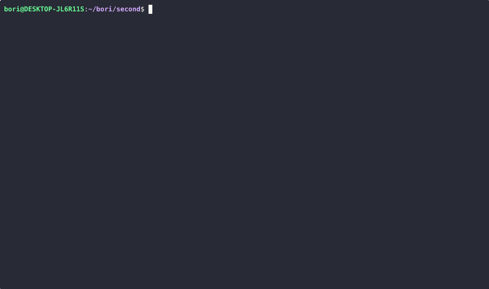

## Kubectl

Pod - smallest unit

Deployment - abstraction over Pods

layers of abstraction: Deployment -> ReplicaSet -> Pod -> Container

Deployment will be what we create, everything after it is managed by Kubernetes.ű

### Pod creating example 1


```bash
kubectl get nodes
kubectl get pod
kubectl create deployment nginx-depl --image=nginx
kubectl get deployment
kubectl get pod
kubectl get replicaset
```

### Pod creating example 2


```bash
kubectl create deployment mongo-depl --image=mongo
kubectl logs [mongo-depl-id]
kubectl get pod
kubectl describe pod [mongo-depl-id]
kubectl exec -it [mongo-depl-id] -- bin/bash
ls
exit
kubectl delete deployment mongo-depl
vim nginx-deployment.yaml
kubectl apply -f nginx-deployment.yaml
```

### Pod creating example 3 (local image with kind)

For using local images, we first need to load the image into the kind cluster with `kind load docker-image web-2048`  Then in the config file under the image tag we need to set `imagePullPolicy: Never`. After this, we apply the config file like in example 2.

Example for config file:
```yaml
apiVersion: apps/v1
kind: Deployment
metadata:
  name: nginx-deployment
  labels:
    app: nginx
spec:
  replicas: 1
  selector: 
    matchLabels:
      app: nginx
  template:
    metadata:
      labels:
        app: nginx
    spec:
      containers:
      - name: web-2048
        image: web-2048
        imagePullPolicy: Never
        ports:
        - containerPort: 80
```

### Kubectl scale example


```bash
kubectl apply -f nginx-deployment.yaml
kubectl scale --replicas=5 deployment/nginx-deployment
kubectl scale --replicas=2 deployment/nginx-deployment
```

### DaemonSet, StatefulSet

```bash
kubectl apply -f daemon-set-example.yaml
kubectl get daemonsets
kubectl get pods
```

daemon-set-example.yaml:

```yaml
apiVersion: apps/v1
kind: DaemonSet
metadata:
  name: my-daemonset
  labels:
    app: my-daemon
spec:
  selector:
    matchLabels:
      app: my-daemon
  template:
    metadata:
      labels:
        app: my-daemon
    spec:
      containers:
      - name: web-2048
        image: web-2048
        imagePullPolicy: Never
        ports:
        - containerPort: 80
```

```bash
kubectl apply -f stateful-set-example.yaml
kubectl get statefulsets
kubectl get pods
```

stateful-set-example.yaml:

```yaml
apiVersion: apps/v1
kind: StatefulSet
metadata:
  name: my-statefulset
spec:
  serviceName: "my-service"
  replicas: 2
  selector:
    matchLabels:
      app: my-app
  template:
    metadata:
      labels:
        app: my-app
    spec:
      containers:
      - name: web-2048
        image: web-2048
        imagePullPolicy: Never
        ports:
        - containerPort: 80
```

Deployments: runs a specified number of identical pods (replicas).

DaemonSet: ensures one pod per node. If a new node is created on the cluster, it automatically gets a pod. When it is removed, the pod also gets removed.

StatefulSet: runs pods with stable identity and storage. Each pod gets incremented id-s, like `pod-0`, `pod-1` (for example pods with deployment get random id-s).

### ConfigMap



```bash
kubectl apply -f configmap.yaml
kubectl get configmaps
kubectl apply -f web-2048-deployment2.yaml
kubectl get pods
kubectl logs [pod-id]
```

configmap.yaml:

```yaml
apiVersion: v1
kind: ConfigMap
metadata:
  name: my-config
data:
    GREETING: "Hello from ConfigMap!"
```

web-2048-deployment2.yaml: (only changed container part)

```yaml
containers:
      - name: web-2048
        image: web-2048
        command: ["sh", "-c", "echo $GREETING && sleep 3600"]
        imagePullPolicy: Never
        ports:
        - containerPort: 80
        env:
        - name: GREETING
          valueFrom:
            configMapKeyRef:
              name: my-config
              key: GREETING
```

### Service

```bash
kubectl apply -f web-2048-deployment.yaml
kubectl apply -f service.yaml
kubectl get services
```

service.yaml:
```yaml
apiVersion: v1
kind: Service
metadata:
  name: nginx-service
spec:
  selector:
    app: nginx 
  ports:
  - protocol: TCP
    port: 80       
    targetPort: 80  
  type: NodePort
```

port forward: `kubectl port-forward service/nginx-service 8080:80`


sources:

https://www.youtube.com/watch?v=azuwXALfyRg

https://iximiuz.com/en/posts/kubernetes-kind-load-docker-image/

https://www.groundcover.com/blog/kubectl-scale

https://kubernetes.io/docs/concepts/workloads/controllers/daemonset/