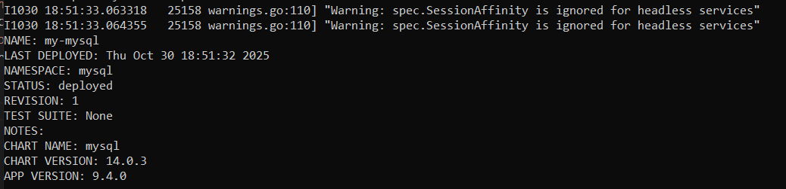
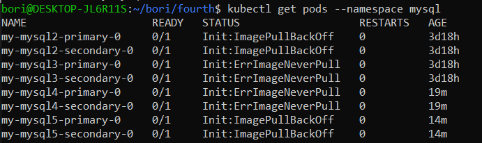
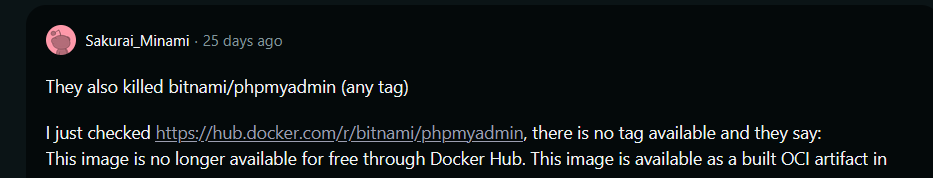
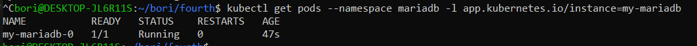
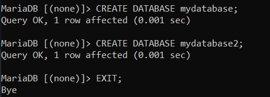
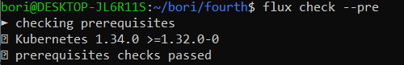
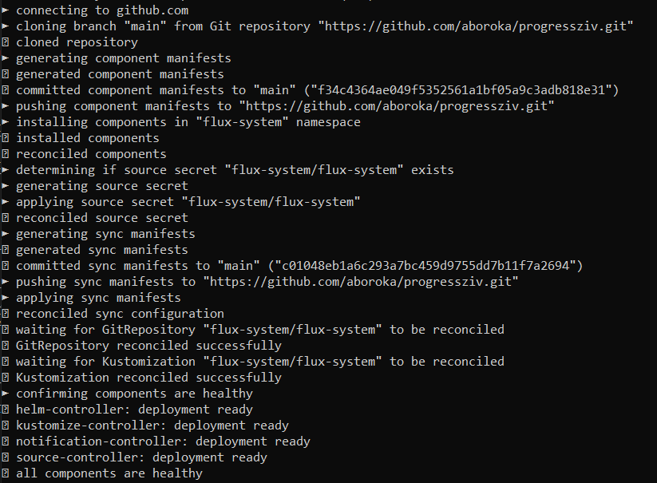
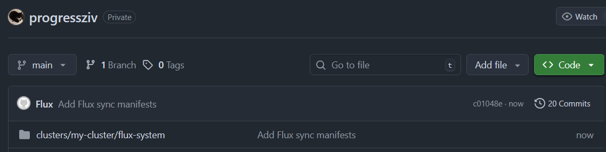
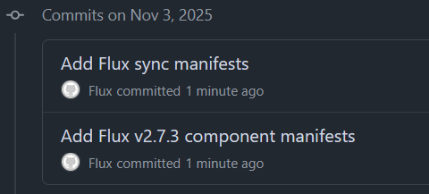

## Custom task - install MySQL and MariaDB databases using Bitnami charts and create two databases in each

### 1. MySQL

Installing MySQL with helm:

```bash
helm install my-mysql6 bitnami/mysql --namespace mysql --create-namespace \
  --set auth.rootPassword=rootpassword \
  --set auth.database=mydatabase \
  --set primary.persistence.size=1Gi \
  --set secondary.persistence.size=1Gi \
  --set architecture=replication \
  --set secondary.replicaCount=2 \
  --set primary.service.port=3306 \
  --set image.pullPolicy=Never
  ```





(also I don't know how to delete helm installs because helm uninstall doesn't work on these)

Solution: -n mysql needed for `helm uninstall` as well (needed for `helm list` as well)

I can't pull bitnami/mysql from docker. Checking on `https://hub.docker.com/r/bitnami/mysql/tags` I see no available tags. Switching to community version.



```bash
docker pull mysql:8.0
helm install my-mysql7 mysql --namespace mysql --create-namespace \
  --set auth.rootPassword=rootpassword \
  --set auth.database=mydatabase \
  --set primary.persistence.size=1Gi \
  --set secondary.persistence.size=1Gi \
  --set architecture=replication \
  --set secondary.replicaCount=2 \
  --set primary.service.port=3306
```

```bash
helm install my-mysql22 bitnami/mysql -n mysql2
```

### 2. MariaDB

```bash
kubectl create namespace mariadb
helm install my-mariadb bitnami/mariadb -n mariadb
kubectl get pods --namespace mariadb -l app.kubernetes.io/instance=my-mariadb
kubectl get pods -n mariadb
```



Password for MariaDB: `wPIkhGwHvP`

Creating database:

`kubectl exec -it -n mariadb my-mariadb-0 -- mysql -uroot -p`

This will ask for password, then after giving the password we can create databases.

```sql
CREATE DATABASE mydatabase;
CREATE DATABASE mydatabase2;
EXIT;
```




## Learn about Flux CD.

Install flux with `curl -s https://fluxcd.io/install.sh | sudo bash`.

Export github credentials:

```bash
export GITHUB_TOKEN=<your-token>
export GITHUB_USER=<your-username>
```

Checking Kubernetes cluster with `flux check --pre`.



## Create a Git Hub repository if you have not already.

done

## Bootstrap Flux CD onto that repository.

```bash
flux bootstrap github \
  --token-auth \
  --owner=aboroka \
  --repository=progressziv \
  --branch=main \
  --path=clusters/my-cluster \
  --personal
```

After this it asks for GitHub PAT. 







sources:

https://fluxcd.io/flux/get-started/

https://docs.github.com/en/authentication/keeping-your-account-and-data-secure/managing-your-personal-access-tokens#creating-a-personal-access-token-classic

https://hub.docker.com/r/bitnami/mysql/tags

https://artifacthub.io/packages/helm/bitnami/mariadb

https://www.tencentcloud.com/techpedia/114109

https://fluxcd.io/flux/installation/bootstrap/github/

https://www.reddit.com/r/linux/comments/1n2hn0j/bitnami_just_killed_off_their_free_docker_images/?q=this+image&type=comments&cId=e2a3b12e-36b7-46c3-a8b0-aec57f523bd1&iId=30b93cd5-d0e4-4327-9172-a578bfdfbb09