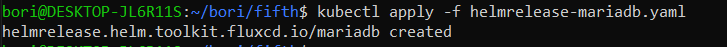
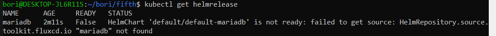
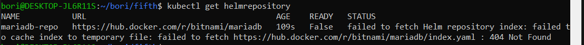
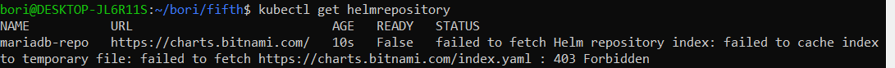
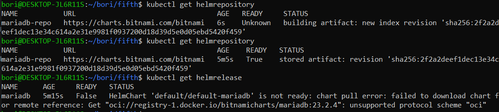
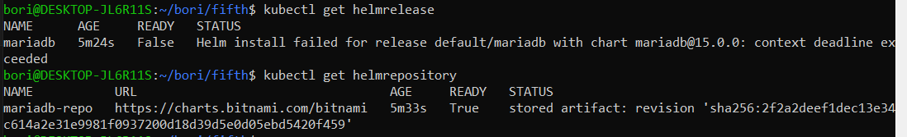
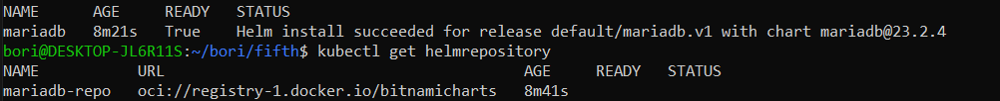
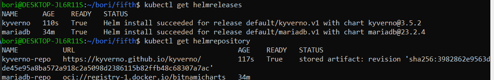

## Custom task - Install mariadb using HelmRelease. Install Kyverno using HelmRelease. (Flux) Why Kyverno is useful? Provide a few examples and explain to us.

### Installing mariadb using HelmRelease

Tried installing with yaml file:

```yaml
apiVersion: helm.toolkit.fluxcd.io/v2
kind: HelmRelease
metadata:
  name: mariadb
  namespace: default
spec:
  interval: 15m
  chart:
    spec:
      chart: mariadb
      sourceRef:
        kind: HelmRepository
        name: mariadb
```
```bash
kubectl apply -f helmrelease-mariadb.yaml
```



```bash
kubectl get helmrelease
```



Solution: need to add MariaDB repository to HelmRelease yaml. 

First try: `url: https://hub.docker.com/r/bitnami/mariadb`



Second try: `https://charts.bitnami.com/`



Third try: `https://charts.bitnami.com/bitnami`



Fourth try: changed version to "15.0.0"



Trying OCI version:



Final yaml:

```yaml
---
apiVersion: source.toolkit.fluxcd.io/v1
kind: HelmRepository
metadata:
  name: mariadb-repo
  namespace: default
spec:
  type: oci
  interval: 15m
  url: oci://registry-1.docker.io/bitnamicharts
---
apiVersion: helm.toolkit.fluxcd.io/v2
kind: HelmRelease
metadata:
  name: mariadb
  namespace: default
spec:
  interval: 15m
  chart:
    spec:
      chart: mariadb
      version: ">=15.0.0"
      sourceRef:
        kind: HelmRepository
        name: mariadb-repo
```

### Installing Kyverno using HelmRelease

```yaml
---
apiVersion: source.toolkit.fluxcd.io/v1
kind: HelmRepository
metadata:
  name: kyverno-repo
  namespace: default
spec:
  interval: 15m
  url: https://kyverno.github.io/kyverno/
---
apiVersion: helm.toolkit.fluxcd.io/v2
kind: HelmRelease
metadata:
  name: kyverno
  namespace: default
spec:
  interval: 15m
  chart:
    spec:
      chart: kyverno
      sourceRef:
        kind: HelmRepository
        name: kyverno-repo
```



### Why Kyverno is useful? Provide a few examples and explain to us.

Kyverno is a policy engine. 

Kubectl apply mainly just checks if the syntax is correct or if there is already a deployment with the same name. -> Kyverno adds extra validation. 

Organizations have certain policies that they have to follow. -> Kyverno can automate this.

Examples:

For example we have a project with multiple teams. For every deployment we want to have a label that corresponds to which team deployed it. With Kyverno we can enforce this, so every deployment without labels set will get rejected. 

```yaml
apiVersion: apps/v1
kind: Deployment
metadata: 
  name: myapp
  labels: 
    team: frontend
spec:
...
```

Or similarly we can enforce a specific release of image, for example `nginx:1.27.0` instead of latest.

```yaml
...
spec:
  selector:
    matchLabels:
      app: myapp
  template:
    metadata:
      labels: 
        app: myapp
    containers:
    - name: myapp
      image: nginx:1.27.0
```

Example for a validation policy:

```yaml
apiVersion: kyverno.io/v1
kind: ClusterPolicy
metadata:
  name: require-deployment-team-label
spec:
  validationFailureAction: Enforce
  rules:
  - name: require-deployment-team-label
    match: 
      any:
      - resources: 
          kinds:
          - Deployment
    validate: 
      message: "You must have label `team` for all deployments"
      pattern:
        metadata:
          labels:
            team: "?*"
```

Example for a mutation policy:

```yaml
apiVersion: kyverno.io/v1
kind: ClusterPolicy
metadata:
  name: set-image-pull-policy
spec:
  rules:
  - name: set-image-pull-policy
    match: 
      any:
      - resources: 
          kinds:
          - Pods
    mutate: 
      patchStrategicMerge:
        spec:
          containers:
            - (image): "*:latest"
              imagePullPolicy: "IfNotPresent"
```

sources:

https://fluxcd.io/flux/components/helm/helmreleases/#install-configuration

https://github.com/bitnami/charts/issues/3166

https://community.broadcom.com/tanzu/blogs/carlos-rodriguez-hernandez/2025/01/14/bitnami-helm-charts-moving-to-oci?CommunityKey=56a49fa1-c592-460c-aa05-019446f8102f

https://kyverno.io/docs/installation/methods/

https://www.youtube.com/watch?v=MxGAuVsJBXE

kyverno.io

https://github.com/kyverno/kyverno